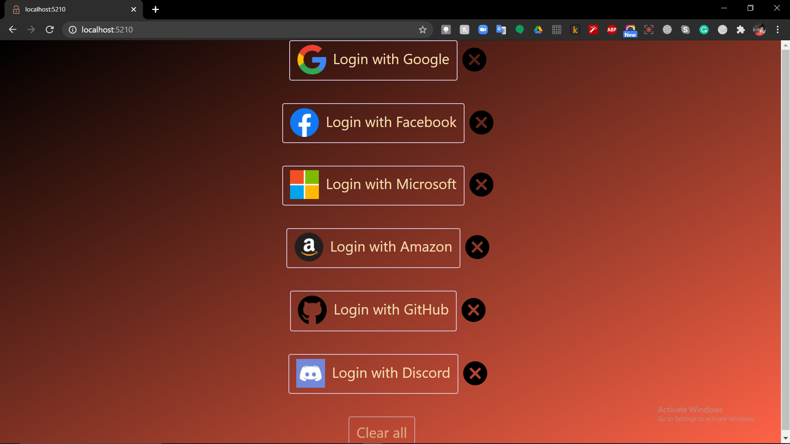

# ZoAuth


ZoAuth is an easy to use authentication sdk and library...
And **this** is the official docs for how to use this beautiful, simple, yet powerful tool. But before we start, I want to acknowledge something. I am so glad that I sat and coded while my friends were playing Fortnite 'coz, well, here I am today! The reason I built ZoAuth was so that authentication would become easy. Something that everyone could do, not just the pros. And I don't **want** others to go through what I went. I want them **not** to suffer. And there's one more thing. If your head is spinning by the time you finish reading this, there's something wrong with you. Blame yourself and not the module. Because unlike most of the docs out there, this one is easy to understand. So don't put all on me.


# Installation

Let's get started. I'm assuming that you have nodeJS installed and a new project set up. If not, go <a href= "https://nodejs.dev/learn">here</a> to learn all about how to get started with node. Now that you've initialized a project, it's time to install my module.
```javascript
npm i zoauth
```
Or, if you want to install the latest edge version — as you would want to do if you have enrolled for my beta testing program — go along and add the ```@test``` tag for ```npm i```.
```javascript
npm i zoauth@test
```

Now that the ZoAuth module is installed, let's require it from your code. Make a new javascript file called ```index.js``` and write the following code:

```javascript
const zoauth = require('zoauth')
```
And you're done. You can do whatever heck you wanna do! But most people reading this don't know what functions to call, you might say. Well, what is an API Reference there for but that?

# Get Started

Now let's really get started, write some code, and impress your friends. (or kids, I don't know how old you are)

```javascript
const zoauth = require('zoauth')
demoApp()
```
And on your terminal,

```
node index.js
```

And how did you like ***that***, huh? I'm not gonna spoil the surprise for you. Go try it out yourself. Come on. I ain't budging till you try it out.

<div style= "background-color: black; height:512px; display: block;">
</div>

Saw it? Ok, so I've been obsessed about ASCII art for around a week now. From when I was a kid, I **loved** it. It never occured to me to try making it. I always wanted to live it to the experts. But then I realised a few days back that there would be websites that do this. And there was. Damn good sites. Check this out.


Neat huh? Ok, sorry! I was getting distracted. Back to the point. Yeah open up your browser and go to ```http://localhost:5210```. And **don't** ask me why I chose that port. It's a goddamn lucky number, man! Like the UI? Here's a photo for the noobs who can't write two lines of code.



Now that you no what my module can do, let's really get deep into it.

# Example code

Ok. Let's start right at the start. What **do** you **really** want to do with OAuth? Sign users in, get access tokens, and call some API's right? Ok. You can do all that and much more with ZoAuth. Here's some example code with an express server. Actually, it's the exact same code that I used for the demo app, except that I used many more companies back there. Now I know what you're going to ask. How can such a simple code do such a complicated task? Simple. Because I made the package.
```javascript
const zoauth = require('zoauth')
const express = require('express')
const app = express()

app.get('/', (req, resp) => {
    resp.redirect(zoauth.google.getAuthUrl())
    })
app.get('/callback/google', (req, resp) => {
    zoauth.google.getToken({code: req.query.code})
        .then(response => {
            zoauth.google.getDetails(response)
                .then(res => {
                    resp.send(res)
                    })
        })
})
```